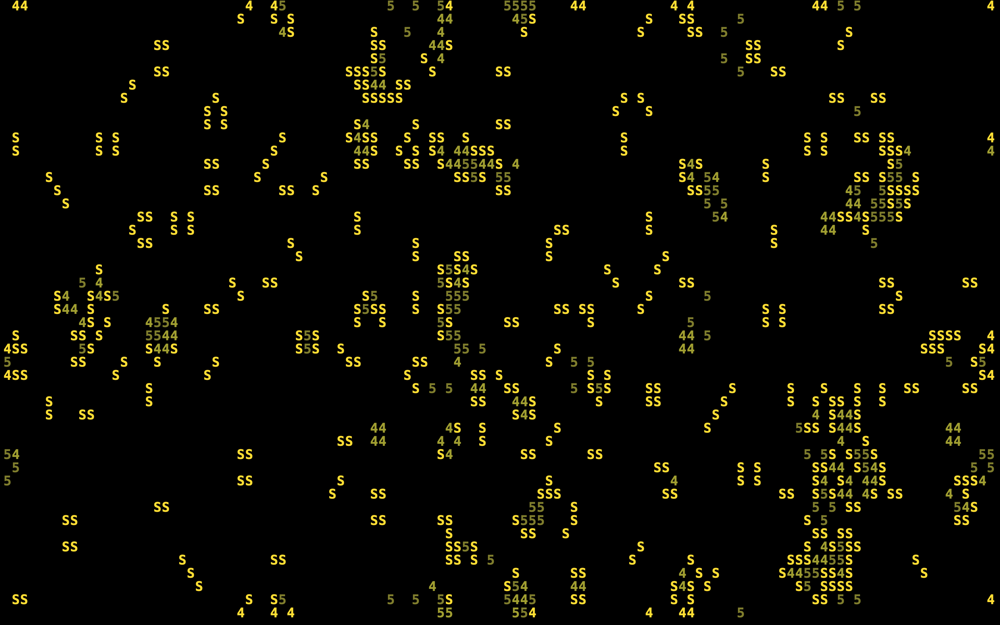
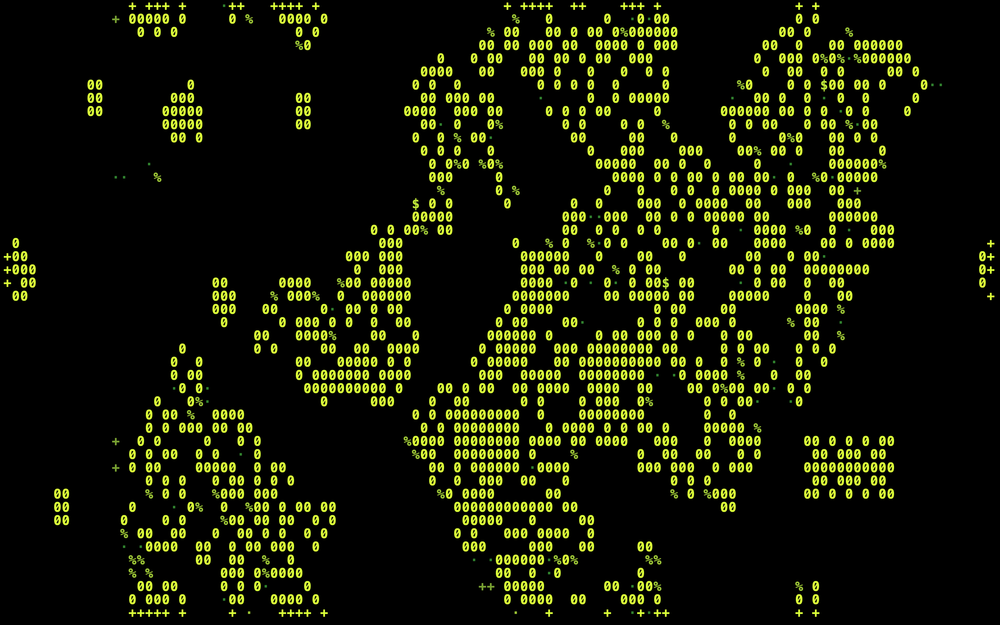
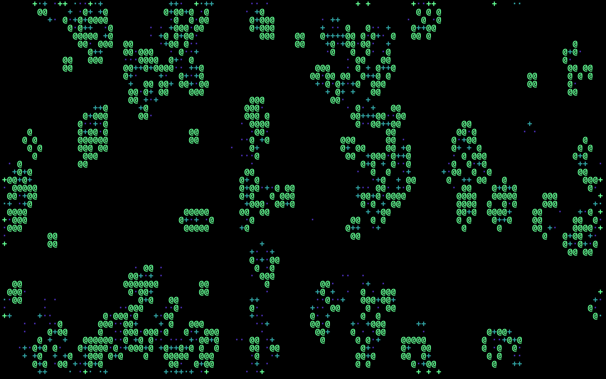
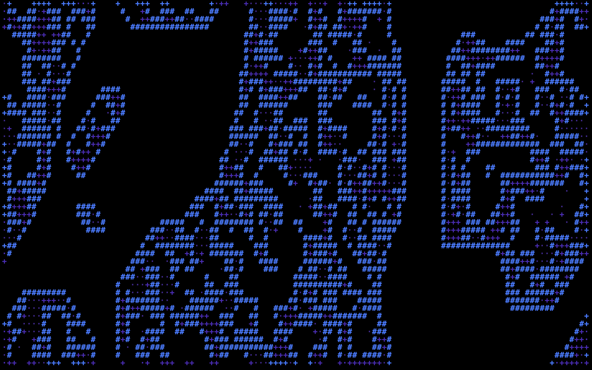
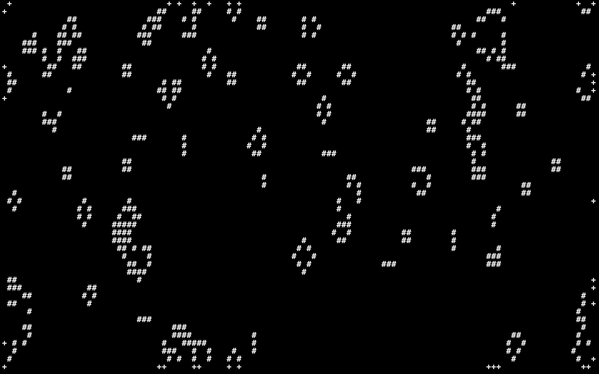
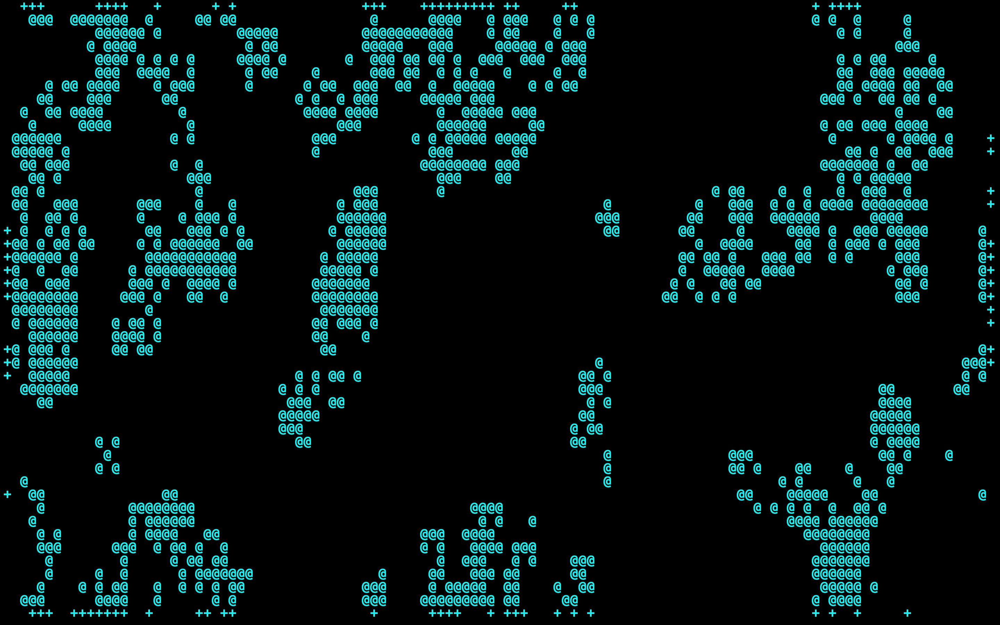
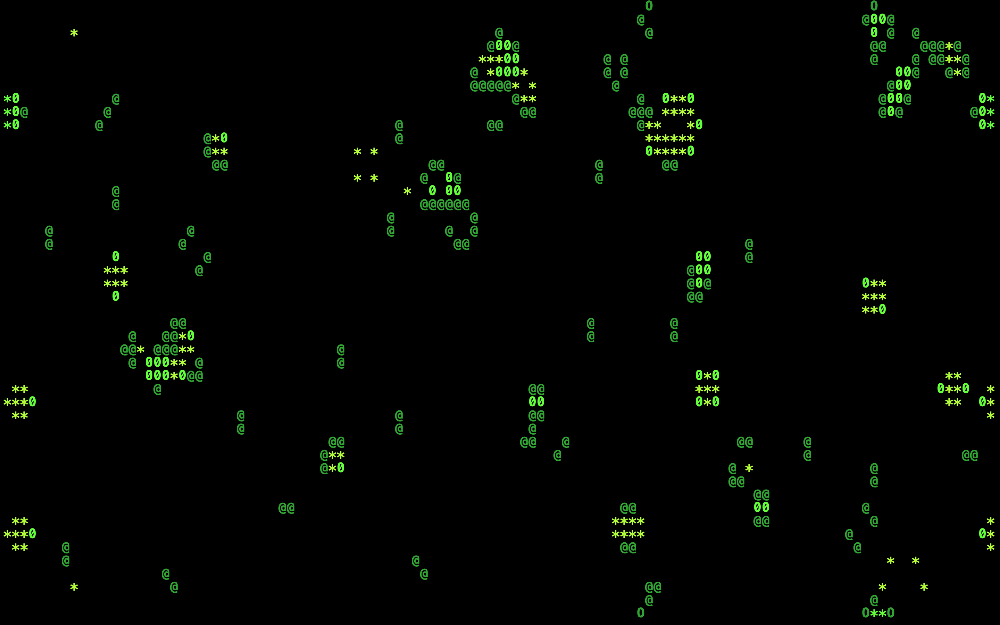
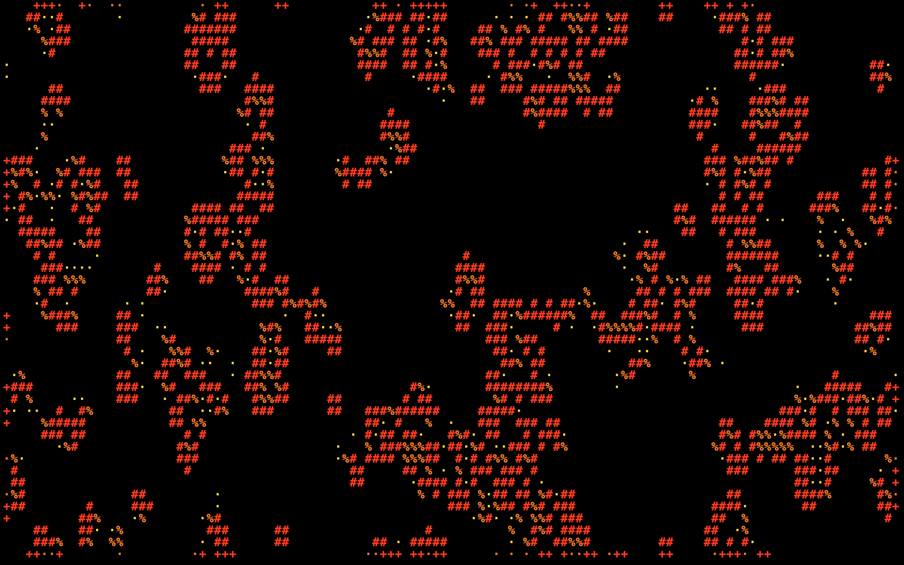
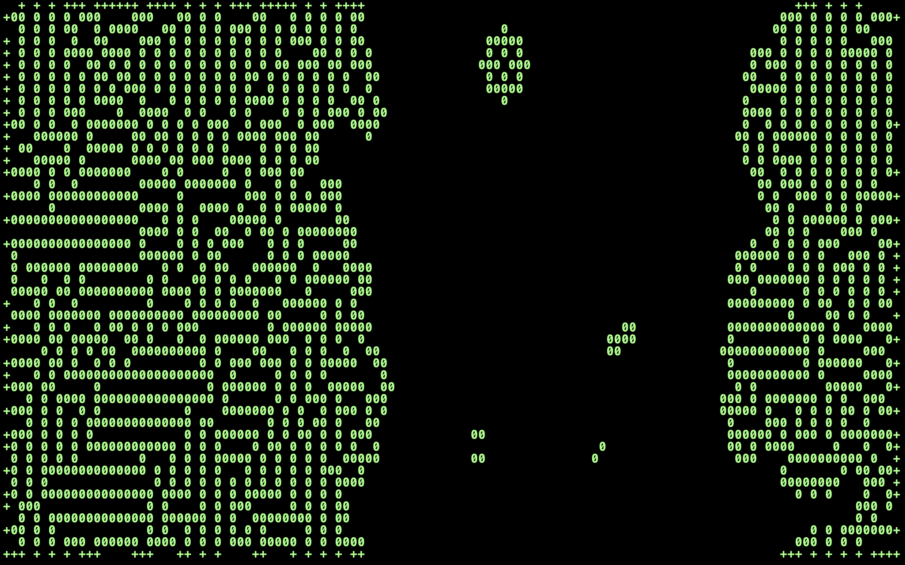
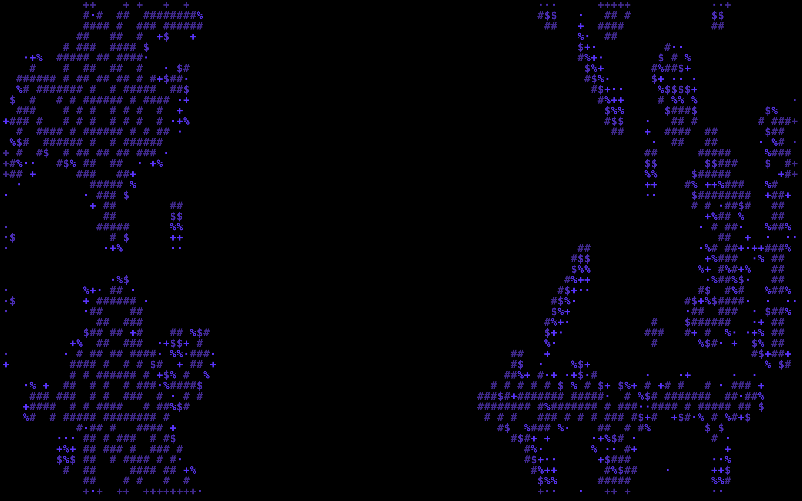

# Screensaver Thingy

This repo contains the source of a screensaver I have on my laptop; just the executable that prints the pretty patterns, not the programs that launch it on inactivity; those are highly platform specific and frankly i have no idea how to implement them here.

---

## Instructions for building:

1. Download and unzip the repository files, also make sure you have cargo installed (the Rust compiler)
2. CD into the project directory:
    
    ```bash
    cd /path/to/gol-screensaver/
    ```

3. Use cargo to compile and execute everything:
    ```bash
    cargo run --release
    ```

The compiled binary should be in the new `/target/release` directory as "gol-screensaver".

---

## Other info:

This was first programmed in C as one of my first largeish projects using the language. I also did a rewrite a few months after (and another one a few months after again) its initial post to github as some practice with using header files among other things.
I then did another rewrite in Rust for practice with the language, simultaneously trying out a new method of display.

If you are curious as to how I have made this a screensaver on MacOS; I used a piece of software called "Sleepwatcher" to trigger executable files and bash scripts on certain inactivity related events.

---

## Here are some screenshots of it in action:









